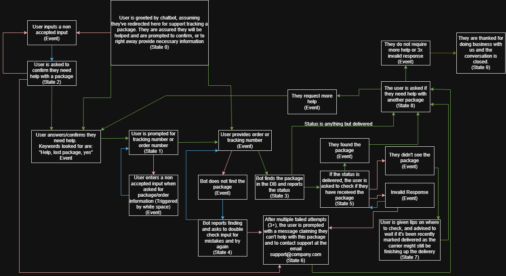

# Package Tracking Application

A full-stack package tracking application built with:

- React
- Vite
- Express
- SQLite using Node's built-in `node:sqlite` module

The application allows orders to be created and looked up using either an order number or tracking number. It also includes a chatbot that guides users through package tracking and delivery-status questions.



---

# Project Structure

```text
project-root/
├── backend/
│   ├── index.js
│   ├── package.json
│   └── orders.db
│
├── frontend/
│   ├── src/
│   ├── package.json
│   ├── vite.config.js
│   └── ...
│
└── README.md
```

The `orders.db` file is generated automatically the first time the backend is started.

---

# Prerequisites

Install the following before running the project:

- Git
- Node.js 25
- npm

This project was developed using:

```text
Node.js v25.3.0
```

If using NVM:

```bash
nvm install 25
nvm use 25
nvm alias default 25
```

Verify your installation:

```bash
node -v
npm -v
```

---

# Clone the Repository

After cloning, move into the project:

```bash
cd REPOSITORY
```

---

# Install Backend Dependencies

Move into the backend folder:

```bash
cd backend
```

Install dependencies:

```bash
npm install
```

The backend uses:

- Express
- Nodemon
- Node's built-in sqlite module (`node:sqlite`)

No separate SQLite installation is required.

---

# Start the Backend

Development mode:

```bash
npm run dev
```

Production mode:

```bash
npm start
```

The backend runs on:

```text
http://localhost:3000
```

When started for the first time, it automatically:

- Creates `orders.db`
- Creates the `orders` table

Expected output:

```text
Connected to SQLite database.
Express server running on http://localhost:3000
```

Leave this terminal running.

---

# Install Frontend Dependencies

Open a second terminal.

Move into the frontend directory:

```bash
cd frontend
```

Install dependencies:

```bash
npm install
```

---

# Start the Frontend

```bash
npm run dev
```

The frontend normally runs on:

```text
http://localhost:5173
```

Open that address in your browser.

The frontend uses Vite's proxy to forward every request beginning with:

```text
/api
```

to

```text
http://localhost:3000
```

Both frontend and backend must be running.

---

# Creating Test Orders

The SQLite database starts empty.

Create a sample order before testing package lookups using the quick add feature on the top of the webpage.

For testing, I made a package with every status seen in the drop downs with order IDs 1-5


The tracking number is randomly generated and will be different every time.

The application accepts either:

```text
1001 (Order ID)
```

or

```text
TRK-123456 (Tracking Number)
```

when searching for a package.

The program will be able to decipher regardless of what you enter. No need to specify if it's a tracking number or Order ID.

---

# Valid Status Values

The backend accepts exactly these values:

```text
Order Received
Shipping
Shipped
Out for Delivery
Delivered

---

# API Endpoints

## Create Order

```http
POST /api/orders
```

Request body:

```json
{
    "orderNumber":"1001",
    "status":"Shipped"
}
```

The backend automatically generates a tracking number.

---

## Lookup Order

```http
GET /api/orders/:number
```

Examples:

```text
GET /api/orders/1001
```

or

```text
GET /api/orders/TRK-123456
```

The backend searches by either:

- order number
- tracking number

---

# Resetting the Database

To start over with an empty database:

1. Stop the backend.
2. Delete `backend/orders.db`.
3. Restart the backend.

Linux/macOS/Git Bash/WSL:

```bash
rm orders.db
npm run dev
```

Windows PowerShell:

```powershell
Remove-Item orders.db
npm run dev
```

The backend automatically recreates the database.

---

# Troubleshooting

## The frontend loads but lookups don't work

Make sure the backend is running.

Expected backend output:

```text
Express server running on http://localhost:3000
```

---

## Every lookup says "No order found"

The database starts empty.

Create at least one order using the POST endpoint before testing.

---

## node:sqlite cannot be found

Verify Node version:

```bash
node -v
```

Expected:

```text
v25.3.0
```

If using NVM:

```bash
nvm use 25
```

---

## Port 3000 already in use

Terminate the existing process using port 3000 or change the `PORT` variable inside:

```text
backend/index.js
```

---

## Port 5173 already in use

Vite will usually choose another port automatically.

Open the URL displayed in the terminal.

---

## API requests return HTML instead of JSON

Verify:

- Backend is running
- Vite proxy forwards `/api` requests to `http://localhost:3000`

---